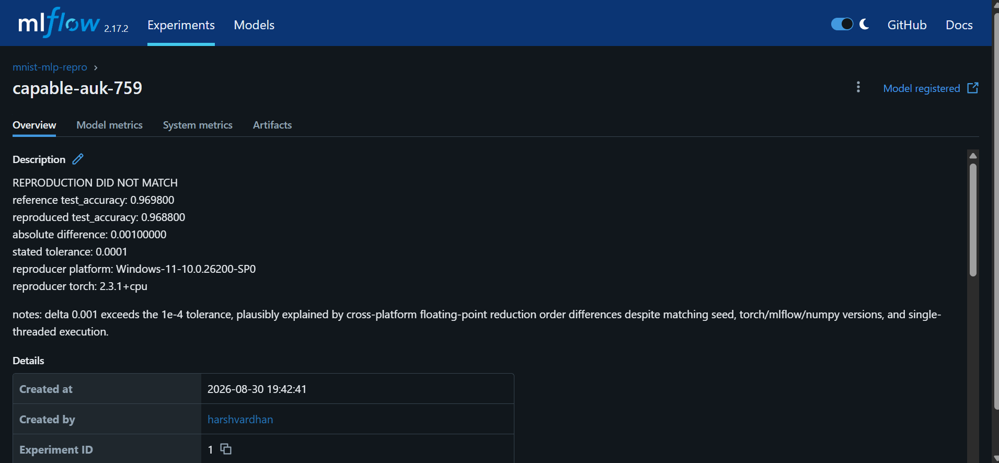

# Reproducibility Verification

## Partner B Work
Partner A had already:

- prepared and committed the project files
- trained the MNIST MLP model
- tracked the experiment using MLflow
- versioned the dataset using DVC
- committed the code and data version together
- provided an environment specification for reproduction
- registered the trained model

My task was to reproduce the experiment on my own **Windows environment** (since my virtual box got hanged due to memory issues), compare the reproduced result with the original reference result, and document the outcome in MLflow.

---

## Repository Used

The shared repository for Question 4 is:

https://github.com/Programing-Ninja/AI_OPS_Q4

I performed the reproduction using **Windows PowerShell**.

---

## 1. Cloning the Repository

First, I cloned the repository shared by Partner A:

```powershell
git clone https://github.com/Programing-Ninja/AI_OPS_Q4.git
```

Then I entered the repository:

```powershell
cd "C:\Users\Administrator\AI_OPS_Q4"
```

---

## 2. Checking Out the Reproduction Version

The repository contained the version prepared for reproduction under the tag `v1-model`.

I checked out that exact version:

```powershell
git checkout v1-model
```

Git displayed a detached HEAD message. This was expected because I was checking out a specific version of the repository for reproduction.

The important point was that the exact code version used for the reproducibility experiment was restored.

---

## 3. Creating the Reproduction Environment

The required environment was specified in `environment.yml`. I created a Python virtual environment for the reproduction.

```powershell
python -m venv mnist_repro_venv
```

I then activated the environment:

```powershell
.\mnist_repro_venv\Scripts\Activate.ps1
```

After activating the environment, I installed the required package versions used for the experiment.

The main versions used were:

```text
torch 2.3.1+cpu
torchvision 0.18.1+cpu
mlflow 2.17.2
numpy 1.26.4
dvc 3.55.2
```

I also verified the installed versions before running the experiment.

```powershell
python -c "import torch, torchvision, mlflow, numpy; print('torch', torch.__version__); print('torchvision', torchvision.__version__); print('mlflow', mlflow.__version__); print('numpy', numpy.__version__)"
```

The output confirmed:

```text
torch 2.3.1+cpu
torchvision 0.18.1+cpu
mlflow 2.17.2
numpy 1.26.4
```

I also checked the DVC installation:

```powershell
dvc --version
```

The DVC version was:

```text
3.55.2
```

---

## 4. Restoring the DVC-Tracked Data

The project used DVC for dataset versioning and remote storage.

I configured the required credentials in the PowerShell session and restored the DVC-tracked data:

```powershell
dvc pull
```

The DVC output showed that the required data files were successfully fetched and restored.

The dataset was therefore available in the workspace before running the reproduction experiment.

---

## 5. Keeping the Working Tree Clean

The training script checks whether the Git working tree is clean before starting the experiment. Since the virtual environment folder was created locally and should not be part of the repository, I excluded it from Git tracking:

```powershell
Add-Content .git\info\exclude "mnist_repro_venv/"
```

I then verified the repository status:

```powershell
git status
```

The working tree was clean, so I was able to continue with the reproduction.

---

## 6. Running the Reproduction Experiment

I reran the training script provided in the repository:

```powershell
python train.py
```

The experiment ran successfully and produced the following validation results:

```text
epoch 1  train_loss=0.271997  val_loss=0.127456  val_acc=0.960800
epoch 2  train_loss=0.102689  val_loss=0.085058  val_acc=0.973700
epoch 3  train_loss=0.068416  val_loss=0.095936  val_acc=0.968800
```

The final reproduced result was:

```text
FINAL  test_loss=0.095936  test_accuracy=0.968800
```

The model was also successfully registered in MLflow.

The reproduced run ID was:

```text
454a28bc0f984887abff4773cec4ed77
```

---

## 7. Comparing the Reproduced Result

The original reference result stored in the repository was:

```text
test_accuracy: 0.969800
```

My reproduced result was:

```text
test_accuracy: 0.968800
```

The absolute difference was:

```text
0.0010000
```

The tolerance specified for the experiment was:

```text
0.0001
```

Therefore:

```text
0.0010000 > 0.0001
```

So the final reproducibility result was:

```text
REPRODUCTION DID NOT MATCH
```

---

## 8. Recording the Result in MLflow

I used the provided `note_run.py` script to document my reproduction result in the MLflow run.

```powershell
python note_run.py --run-id 9fc26bff1ad44dc190d6720eef731fe8 --your-accuracy 0.9688 --comment "delta 0.001 exceeds the 1e-4 tolerance, plausibly explained by cross-platform floating-point reduction order differences despite matching seed, torch/mlflow/numpy versions, and single-threaded execution."
```

The final output was:

```text
REPRODUCTION DID NOT MATCH
reference test_accuracy: 0.969800
reproduced test_accuracy: 0.968800
absolute difference: 0.00100000
stated tolerance: 0.0001
reproducer platform: Windows-11-10.0.26200-SP0
reproducer torch: 2.3.1+cpu
```

The result was therefore successfully documented in MLflow.

---

## 9. Explanation for the Difference

The reproduced result was very close to the original result, but it did not fall within the required tolerance.

The original experiment was reproduced on a different platform. I performed the reproduction on:

```text
Windows-11-10.0.26200-SP0
```

using:

```text
PyTorch 2.3.1+cpu
```

Small differences can occur across operating systems and CPU environments because floating-point calculations may be performed in slightly different orders by different numerical backends.

Even with:

- the same random seed
- the same model code
- matching main library versions
- single-threaded execution

small floating-point differences can accumulate during model training.

In this case, the difference was only `0.0010`, which means the reproduction was very close to the reference result. However, the required tolerance was `0.0001`, so the experiment was correctly recorded as:

```text
REPRODUCTION DID NOT MATCH
```
---

## 10. Updating the Shared Repository

After documenting the reproduction result, I committed my Partner B work.

```powershell
git add note_run.py mlflow.db
```

I created a commit describing the reproduction outcome:

```powershell
git commit -m "Partner B reproduction: fix note_run.py description bug, log correct verdict (mismatch, delta=0.001, cross-platform)"
```

Since the reproduction was performed from a detached HEAD state, I created a temporary branch to preserve my work:

```powershell
git branch save-work
```

I then returned to the main branch:

```powershell
git checkout master
```

The reproduction work was merged into the main branch:

```powershell
git merge save-work
```

Finally, I pushed the completed work to the shared repository:

```powershell
git push origin master
```

---

## 11. Main Reproduction Commands

The main commands used during my reproduction work were:

```powershell
git clone https://github.com/Programing-Ninja/AI_OPS_Q4.git

cd "C:\Users\Administrator\AI_OPS_Q4"

git checkout v1-model

python -m venv mnist_repro_venv

.\mnist_repro_venv\Scripts\Activate.ps1

dvc pull

Add-Content .git\info\exclude "mnist_repro_venv/"

python train.py

python note_run.py --run-id 9fc26bff1ad44dc190d6720eef731fe8 --your-accuracy 0.9688 --comment "delta 0.001 exceeds the 1e-4 tolerance, plausibly explained by cross-platform floating-point reduction order differences despite matching seed, torch/mlflow/numpy versions, and single-threaded execution."
```

The core reproducibility workflow was:

```powershell
git clone
git checkout v1-model
restore DVC-tracked data
create the required environment
python train.py
compare the result
log the result in MLflow
```

---

## 12. MLflow Evidence

The screenshot below shows the MLflow reproduction result.

It displays:

- the reproduction status
- the reference accuracy
- the reproduced accuracy
- the absolute difference
- the allowed tolerance
- the Windows platform used for reproduction
- the PyTorch version



---

## Final Conclusion

As Partner B, I successfully reproduced the experiment using the repository, version-controlled code, DVC-tracked data, and the required Python environment.

My final reproduced accuracy was:

```text
0.968800
```

The original reference accuracy was:

```text
0.969800
```

The difference was:

```text
0.0010000
```

The required tolerance was:

```text
0.0001
```

Because the difference exceeded the specified tolerance, the final result was correctly recorded as:

```text
REPRODUCTION DID NOT MATCH
```

The experiment was nevertheless reproduced very closely, with the small difference plausibly explained by cross-platform floating-point computation differences.
